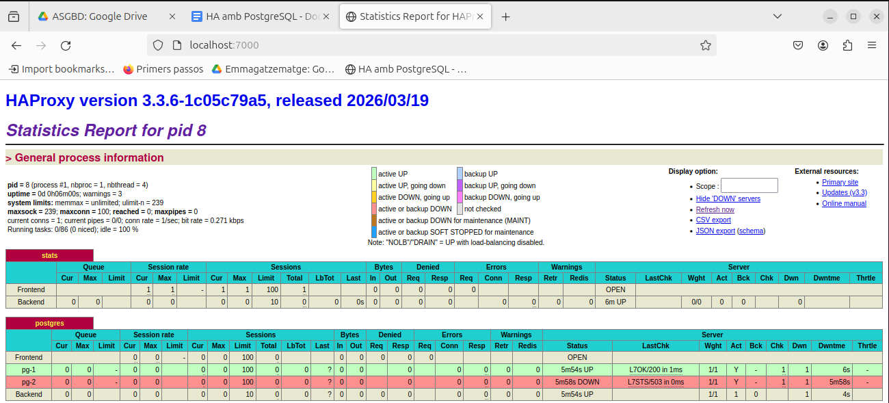
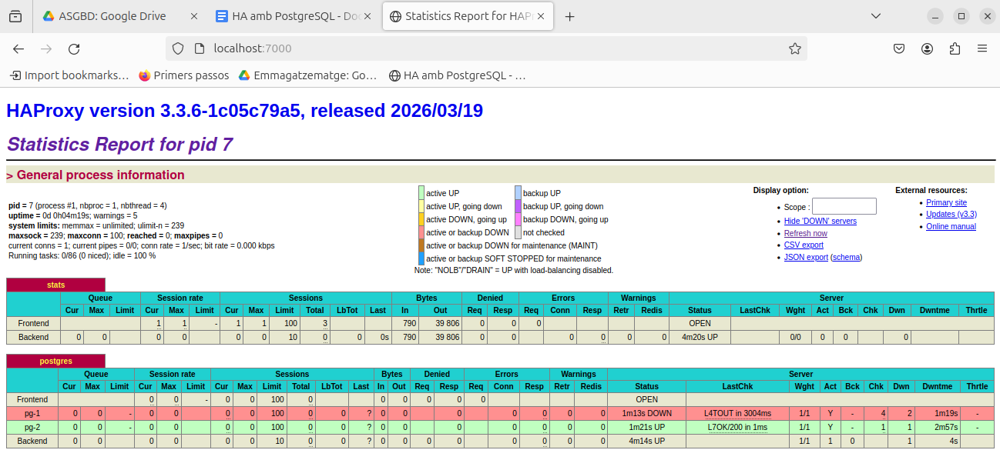

# HA con PostgreSQL

La siguiente documentación y preguntas respondidas son una guía práctica detallada a partir del problema planteado en el siguiente enunciado:  
(https://github.com/mvm-classroom/mvm-recursos/blob/main/cicles/ASIX/ASGBD/Exercicis/ha-postgresql.md)

## ¿Para qué están pensados estos archivos?

Se pretende montar un sistema de PostgreSQL de alta disponibilidad usando contenedores de Docker. Habrá dos nodos de base de datos, uno principal y una réplica. Si falla el principal, el sistema debe poder seguir funcionando con el otro nodo.

## ¿Qué tecnologías utiliza y para qué sirve cada una?

Como he comentado antes, se usa Docker y Docker Compose para crear y arrancar los contenedores. También usa PostgreSQL como base de datos, Patroni para gestionar el clúster y el cambio de líder, etcd para coordinar el estado del clúster y HAProxy para dar un único punto de acceso. Cada herramienta tiene una función concreta para que la base de datos siga disponible aunque falle un nodo.

## ¿Cómo podemos comprobar si todo esto funciona?

Primero hay que levantar los contenedores con `docker compose up -d --build`.

Una vez se ejecutan, se puede comprobar el estado del clúster con `patronictl list`, revisar la web de HAProxy en el puerto 7000 y probar una conexión a PostgreSQL.

La prueba más importante es parar el nodo principal y ver si el otro pasa a ser el nuevo principal o líder.

## Instalación de Docker y Docker Compose

Para llevar a cabo la verificación de que todo puede funcionar correctamente, seguiremos los pasos detallados a continuación.

En primer lugar, haremos la instalación de Docker y Docker Compose:

```bash
isard@dosorio-proxy:~$ sudo apt install docker.io docker-compose-v2 -y
````

## Creación de la carpeta de trabajo

Seguidamente, haremos la creación de la carpeta en la que trabajaremos con ambos servicios:

```bash
isard@dosorio-proxy:~/Escriptori$ mkdir ha-postgresql
```

Una vez en la carpeta, crearemos los distintos archivos proporcionados para poder llevar a cabo la implementación con los siguientes comandos.

## Archivo Dockerfile

Para el archivo `Dockerfile` usaremos:

```bash
isard@dosorio-proxy:~/Escriptori/ha-postgresql$ nano Dockerfile
```

Dentro del archivo, pondremos lo siguiente:

```dockerfile
FROM postgres:15-bullseye

USER root

RUN apt-get update && \
	apt-get install -y patroni python3-etcd curl && \
	rm -rf /var/lib/apt/lists/*

USER postgres

CMD ["patroni", "/patroni.yml"]
```

Guardamos, salimos y hacemos este mismo procedimiento con los 3 archivos restantes.

## Archivo patroni.yml

```bash
isard@dosorio-proxy:~/Escriptori/ha-postgresql$ nano patroni.yml
```

Dentro lo dejaremos de la siguiente manera:

```yaml
scope: mi_cluster_ha
namespace: /db/

restapi:
  listen: 0.0.0.0:8008

etcd:
  host: etcd:2379

bootstrap:
  dcs:
	ttl: 30
	loop_wait: 10
	retry_timeout: 10
	maximum_lag_on_failover: 1048576
	postgresql:
  	use_pg_rewind: true
  initdb:
	- auth-host: scram-sha-256
	- auth-local: trust
	- encoding: UTF8
  users:
	admin:
  	password: Dhayanseña07
  	options:
    	- createrole
    	- createdb

postgresql:
  listen: 0.0.0.0:5432
  data_dir: /var/lib/postgresql/data/patroni
  pg_hba:
	- host replication dosorioreplica all scram-sha-256
	- host all all all scram-sha-256
  authentication:
	replication:
  	username: dosorioreplica
  	password: dhayan07
	superuser:
  	username: dosoriouser
  	password: dhayan07
```

## Archivo haproxy.cfg

```bash
isard@dosorio-proxy:~/Escriptori/ha-postgresql$ nano haproxy.cfg
```

Lo dejamos tal cual:

```cfg
global
	maxconn 100

defaults
	log global
	mode tcp
	retries 2
	timeout client 30m
	timeout connect 4s
	timeout server 30m
	timeout check 5s

listen stats
	mode http
	bind *:7000
	stats enable
	stats uri /

listen postgres
	bind *:5432
	option httpchk GET /primary
	http-check expect status 200

	default-server inter 3s fall 3 rise 2 on-marked-down shutdown-sessions

	server pg-1 pg-1:5432 maxconn 100 check port 8008
	server pg-2 pg-2:5432 maxconn 100 check port 8008
```

## Archivo docker-compose.yml

```bash
isard@dosorio-proxy:~/Escriptori/ha-postgresql$ nano docker-compose.yml
```

Y dentro lo dejamos de esta manera:

```yaml
networks:
  ha-net:
	driver: bridge

services:
  # Etcd
  etcd:
	image: quay.io/coreos/etcd:v3.5.9
	container_name: etcd
	networks:
  	- ha-net
	environment:
  	- ETCD_LISTEN_CLIENT_URLS=http://0.0.0.0:2379
  	- ETCD_ADVERTISE_CLIENT_URLS=http://etcd:2379
  	- ETCD_ENABLE_V2=true

  # Node 1
  pg-1:
	build: .
	container_name: pg-1
	networks:
  	- ha-net
	volumes:
  	- ./patroni.yml:/patroni.yml:ro
  	- pg_1_data:/var/lib/postgresql/data
	environment:
  	- PATRONI_NAME=pg-1
  	- PATRONI_RESTAPI_CONNECT_ADDRESS=pg-1:8008
  	- PATRONI_POSTGRESQL_CONNECT_ADDRESS=pg-1:5432
	depends_on:
  	- etcd

  # Node 2
  pg-2:
	build: .
	container_name: pg-2
	networks:
  	- ha-net
	volumes:
  	- ./patroni.yml:/patroni.yml:ro
  	- pg_2_data:/var/lib/postgresql/data
	environment:
  	- PATRONI_NAME=pg-2
  	- PATRONI_RESTAPI_CONNECT_ADDRESS=pg-2:8008
  	- PATRONI_POSTGRESQL_CONNECT_ADDRESS=pg-2:5432
	depends_on:
  	- etcd

  # HAProxy
  haproxy:
	image: haproxy:alpine
	container_name: haproxy
	ports:
  	- "5432:5432"
  	- "7000:7000"
	networks:
  	- ha-net
	volumes:
  	- ./haproxy.cfg:/usr/local/etc/haproxy/haproxy.cfg:ro
	depends_on:
  	- pg-1
  	- pg-2

volumes:
  pg_1_data:
  pg_2_data:
```

## Comprobación de los archivos creados

Antes de arrancar nada, conviene confirmar que todos los archivos se han creado correctamente. Lo revisamos de la siguiente forma:

```bash
isard@dosorio-proxy:~/Escriptori/ha-postgresql$ ls -l
total 16
-rw-rw-r-- 1 isard isard 1329 d’abr.	6 01:12 docker-compose.yml
-rw-rw-r-- 1 isard isard  196 d’abr.	6 01:02 Dockerfile
-rw-rw-r-- 1 isard isard  525 d’abr.	6 01:09 haproxy.cfg
-rw-rw-r-- 1 isard isard  775 d’abr.	6 01:08 patroni.yml
```

## Arranque del sistema

Una vez comprobado, podemos arrancar todo el sistema:

```bash
isard@dosorio-proxy:~/Escriptori/ha-postgresql$ sudo docker compose up -d --build
```

## Comprobación de servicios

Seguidamente, pasaremos a comprobar que los servicios han arrancado correctamente:

```bash
isard@dosorio-proxy:~/Escriptori/ha-postgresql$ sudo docker compose ps
NAME  	IMAGE                    	COMMAND              	SERVICE   CREATED      	STATUS      	PORTS
etcd  	quay.io/coreos/etcd:v3.5.9   "/usr/local/bin/etcd"	etcd  	31 seconds ago   Up 31 seconds   2379-2380/tcp
haproxy   haproxy:alpine           	"docker-entrypoint.s…"   haproxy   31 seconds ago   Up 30 seconds   0.0.0.0:5432->5432/tcp, [::]:5432->5432/tcp, 0.0.0.0:7000->7000/tcp, [::]:7000->7000/tcp
pg-1  	ha-postgresql-pg-1       	"docker-entrypoint.s…"   pg-1  	31 seconds ago   Up 30 seconds   5432/tcp
pg-2  	ha-postgresql-pg-2       	"docker-entrypoint.s…"   pg-2  	31 seconds ago   Up 30 seconds   5432/tcp
```

Como hemos podido comprobar, efectivamente así ha sido y todo está en marcha.

## Estado del clúster con Patroni

Lo siguiente es ver el estado del clúster con Patroni. Para ello usaremos el siguiente comando:

```bash
isard@dosorio-proxy:~/Escriptori/ha-postgresql$ sudo docker exec -it pg-1 patronictl -c /patroni.yml list
+ Cluster: mi_cluster_ha (7625442314187341845) ----------+-----+------------+-----+
| Member | Host | Role	| State 	| TL | Receive LSN | Lag | Replay LSN | Lag |
+--------+------+---------+-----------+----+-------------+-----+------------+-----+
| pg-1   | pg-1 | Leader  | running   |  1 |         	| 	|        	| 	|
| pg-2   | pg-2 | Replica | streaming |  1 |   0/3000060 |   0 |  0/3000060 |   0 |
+--------+------+---------+-----------+----+-------------+-----+------------+-----+
```

Tal como se ve en la salida anterior, los dos nodos están activos, uno como leader funcionando y el otro como réplica parado esperando.

Si entramos en el navegador a la URL de `localhost` con el puerto `7000`, nos enseña el panel web de HAProxy, donde nos indica el estado de los nodos.

<figure>
  
</figure>

## Instalación del cliente PostgreSQL

Seguidamente, instalaremos PostgreSQL cliente para continuar con las pruebas. Para ello haremos uso del siguiente comando:

```bash
isard@dosorio-proxy:~/Escriptori/ha-postgresql$ sudo apt install postgresql-client -y
```

## Comprobación de conexión a través de HAProxy

El siguiente paso es comprobar la conexión al sistema a través de HAProxy. Para ello entraremos con el usuario de PostgreSQL definido anteriormente en el archivo de Patroni:

```bash
isard@dosorio-proxy:~/Escriptori/ha-postgresql$ psql -h 127.0.0.1 -p 5432 -U dosoriouser -d postgres
Password for user dosoriouser:
psql (16.13 (Ubuntu 16.13-0ubuntu0.24.04.1), server 15.13 (Debian 15.13-1.pgdg110+1))
Type "help" for help.

postgres=#
```

De esta manera, hemos podido comprobar que podemos entrar sin problema.

## Prueba de funcionalidad de la base de datos

Lo siguiente es comprobar la funcionalidad de la base de datos, viendo si podemos introducir datos y consultarlos. Para ello, usaremos los siguientes comandos.

Creamos la tabla:

```sql
postgres=# CREATE TABLE prueba_ha (id SERIAL PRIMARY KEY, mensaje VARCHAR(180), fecha TIMESTAMP DEFAULT NOW()
);
CREATE TABLE
```

Ahora introducimos los datos:

```sql
postgres=# INSERT INTO prueba_ha (mensaje) VALUES ('si que funciona jeje');
INSERT 0 1
```

Finalmente comprobamos los datos:

```sql
postgres=# SELECT * FROM prueba_ha;
 id |   	mensaje    	|       	fecha       	 
----+----------------------+----------------------------
  1 | si que funciona jeje | 2026-04-06 01:00:41.633691
(1 row)
```

Efectivamente, el funcionamiento de la tabla es correcto.

## Comprobación del failover

La siguiente parte es comprobar cuál es el nodo que actúa como líder para poder detenerlo y que el otro nodo actúe en su lugar. Para ello, igual que antes, usamos el siguiente comando:

```bash
isard@dosorio-proxy:~/Escriptori/ha-postgresql$ sudo docker exec -it pg-1 patronictl -c /patroni.yml list
+ Cluster: mi_cluster_ha (7625442314187341845) ----------+-----+------------+-----+
| Member | Host | Role	| State 	| TL | Receive LSN | Lag | Replay LSN | Lag |
+--------+------+---------+-----------+----+-------------+-----+------------+-----+
| pg-1   | pg-1 | Leader  | running   |  1 |         	| 	|        	| 	|
| pg-2   | pg-2 | Replica | streaming |  1 |   0/3000060 |   0 |  0/3000060 |   0 |
+--------+------+---------+-----------+----+-------------+-----+------------+-----+
```

Como se puede ver, el nodo que actúa como líder es `pg-1`. Procederemos a pararlo con el siguiente comando:

```bash
isard@dosorio-proxy:~/Escriptori/ha-postgresql$ sudo docker stop pg-1
pg-1
```

Ahora comprobaremos si `pg-2` pasa a ser el líder:

```bash
isard@dosorio-proxy:~/Escriptori/ha-postgresql$ sudo docker exec -it pg-2 patronictl -c /patroni.yml list
+ Cluster: mi_cluster_ha (7625442314187341845) --------+-----+------------+-----+
| Member | Host | Role	| State   | TL | Receive LSN | Lag | Replay LSN | Lag |
+--------+------+---------+---------+----+-------------+-----+------------+-----+
| pg-1   | pg-1 | Replica | stopped |	| 	unknown | 	|	unknown | 	|
| pg-2   | pg-2 | Leader  | running |  2 |         	| 	|        	| 	|
+--------+------+---------+---------+----+-------------+-----+------------+-----+
```

Al comprobarlo, podemos ver que `pg-1` se encuentra parado y actuando como réplica, mientras que `pg-2` ahora actúa como líder y está en funcionamiento.

Si ahora lo comprobamos desde el panel web de HAProxy, podemos ver gráficamente cómo `pg-2` está operativo y `pg-1` se encuentra parado.

<figure>
  
</figure>

## Comprobación de la base de datos tras la caída del nodo principal

Ahora pasaremos a comprobar que la base de datos sigue funcionando incluso tras la caída del primer nodo. Para ello, volvemos a entrar a la base de datos y haremos una consulta sobre lo que habíamos creado anteriormente:

```bash
isard@dosorio-proxy:~/Escriptori/ha-postgresql$ sudo docker exec -it pg-2 patronictl -c /patroni.yml list
+ Cluster: mi_cluster_ha (7625445730543566869) --------+-----+------------+-----+
| Member | Host | Role	| State   | TL | Receive LSN | Lag | Replay LSN | Lag |
+--------+------+---------+---------+----+-------------+-----+------------+-----+
| pg-1   | pg-1 | Replica | stopped |	| 	unknown | 	|	unknown | 	|
| pg-2   | pg-2 | Leader  | running |  2 |         	| 	|        	| 	|
+--------+------+---------+---------+----+-------------+-----+------------+-----+
isard@dosorio-proxy:~/Escriptori/ha-postgresql$ psql -h 127.0.0.1 -p 5432 -U dosoriouser -d postgres
Password for user dosoriouser:
psql (16.13 (Ubuntu 16.13-0ubuntu0.24.04.1), server 15.13 (Debian 15.13-1.pgdg110+1))
Type "help" for help.

postgres=# SELECT * FROM prueba_ha;
 id |   	mensaje    	|       	fecha       	 
----+----------------------+----------------------------
  1 | si que funciona jeje | 2026-04-06 01:04:32.974469
(1 row)
```

Una vez comprobado, volvemos a iniciar el nodo que habíamos parado con:

```bash
isard@dosorio-proxy:~/Escriptori/ha-postgresql$ sudo docker start pg-1
pg-1
```

## Comprobación del nodo recuperado

Comprobamos que ha iniciado y, de ser así, si está actuando como líder o como réplica. De forma general, suelen iniciar como réplica:

```bash
isard@dosorio-proxy:~/Escriptori/ha-postgresql$ sudo docker exec -it pg-1 patronictl -c /patroni.yml list
+ Cluster: mi_cluster_ha (7625445730543566869) ----------+-----+------------+-----+
| Member | Host | Role    | State     | TL | Receive LSN | Lag | Replay LSN | Lag |
+--------+------+---------+-----------+----+-------------+-----+------------+-----+
| pg-1   | pg-1 | Replica | streaming |  2 |   0/3073FD8 |   0 |  0/3073FD8 |   0 |
| pg-2   | pg-2 | Leader  | running   |  2 |             |     |            |     |
+--------+------+---------+-----------+----+-------------+-----+------------+-----+
```

Y efectivamente, así ha sido. El nodo `pg-1` ha iniciado correctamente, pero como réplica, esperando atento a que si `pg-2` falla, vuelva a tomar el sitio de líder para seguir funcionando sin que se caigan los servicios.

Dando por completada la práctica con éxito.
